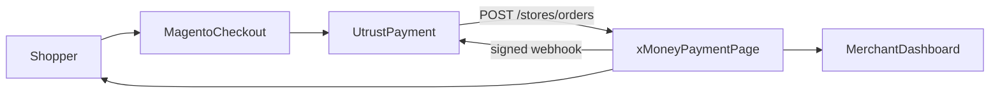
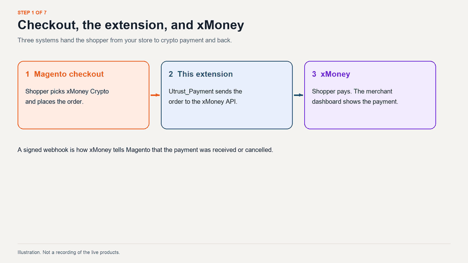

# xMoney Crypto for Magento 2

Accept Bitcoin, Ethereum, eGLD, UTK, and other cryptocurrencies on a Magento store. The shopper pays on the xMoney payment page. You settle in the currency you choose with xMoney.

This repository is the Magento payment extension. It is the piece that connects your store checkout to [xMoney Crypto Pay](https://xmoney.com/crypto-pay). xMoney is a digital payments network powered by [MultiversX](https://multiversx.com/).

## Who this is for

**You run a Magento store.** Install the extension, connect your xMoney merchant account, and turn the payment method on. Start with the short checklist below, then follow the [store setup guide](docs/store_guide.md).

**You are new to Magento.** Magento (Magento Open Source or Adobe Commerce) is the software that runs the store: catalog, cart, checkout, and the admin. Install Magento first, then install this extension. The [store setup guide](docs/store_guide.md) links the Magento installation docs and then the steps for this extension.

**You are developing this extension.** Put this repository inside a local Magento store and work from the source. The [developer guide](docs/developer_guide.md) covers local install, the code map, both checkout flows, webhooks, logs, and tests.

## How the extension works

The extension adds a payment method named **xMoney Crypto – Pay with crypto**. At checkout the shopper selects it and continues to the xMoney payment page. xMoney tells the store what happened by calling a webhook on your Magento site. The extension checks the signature on that call, then invoices the order or cancels it.



Two timings are available in the admin under **Checkout Flow**. With **Alternative** set to **No**, Magento creates the order when the shopper places it, then sends that order to xMoney. With **Alternative** set to **Yes**, Magento creates the order when xMoney reports that the payment was detected. The [developer guide](docs/developer_guide.md) diagrams both paths, including payment received and payment cancelled.

The clip below is an illustration of that handoff. It is a drawing of the steps, so the screens are labeled stand-ins for the live products.



This second clip is a real Magento storefront using the Luma theme. It shows a shopper opening a product and adding it to the cart, which is the start of checkout before the payment step.


## Requirements

- Magento Open Source 2.4.7-p10 on PHP 8.2 for the local sandbox in the [developer guide](docs/developer_guide.md). The package constraint is `magento/framework` 102 or newer and PHP 7.4 or newer. Use the PHP version your Magento release requires. See the [Magento system requirements](https://experienceleague.adobe.com/en/docs/commerce-operations/installation-guide/system-requirements).
- An xMoney Crypto merchant account on the [sandbox dashboard](https://merchants.sandbox.crypto.xmoney.com/) for testing, or the [live dashboard](https://merchants.crypto.xmoney.com/) for real payments.
- SSH access to the Magento server so you can run `bin/magento`.

The store base currency must be one xMoney supports, or the payment method stays hidden at checkout. The [store setup guide](docs/store_guide.md) lists those currencies.

## Install at a glance

**Store owners** download a release and copy it into the Magento code directory.

1. Download the latest zip from the [releases page](https://github.com/utrustdev/xmoney-crypto-for-magento2/releases).
2. Unzip it to `app/code/Utrust/Payment` in your Magento root.
3. From the Magento root, enable the module, apply updates, and flush the cache.

```bash
bin/magento module:enable Utrust_Payment
bin/magento setup:upgrade
bin/magento cache:flush
```

On a production-mode store, run `bin/magento setup:upgrade --keep-generated`, then deploy static content so the checkout assets are published. The [store setup guide](docs/store_guide.md) has the full commands, the update steps, and uninstall.

**Developers** work from this repository, placed at `app/code/Utrust/Payment` inside a local Magento store in [developer mode](https://experienceleague.adobe.com/en/docs/commerce-operations/configuration-guide/cli/set-mode). Commands are in the [developer guide](docs/developer_guide.md).

If Magento itself is not installed yet, use Adobe’s [Composer installation guide](https://experienceleague.adobe.com/en/docs/commerce-operations/installation-guide/composer) or the Docker sandbox in the [developer guide](docs/developer_guide.md). That sandbox is Magento Open Source 2.4.7-p10 on PHP 8.2, using [Mark Shust's Docker setup](https://github.com/markshust/docker-magento#setup). Store Composer keys only in your local `auth.json`.

## Connect xMoney to the store

1. Open the [sandbox dashboard](https://merchants.sandbox.crypto.xmoney.com/) or the [live dashboard](https://merchants.crypto.xmoney.com/).
2. In the left sidebar, open **Integrations**, select **Magento 2**, and click **Generate Credentials**.
3. Copy the **Api Key** and the **Webhook Secret**. The Webhook Secret is shown once. If you leave the page before copying it, generate credentials again. Keep both values private. Anyone with them can create orders for your store.
4. In the Magento admin, open **Stores → Configuration → Sales → Payment Methods → xMoney Crypto**. Paste the key and secret, set **Test mode** to match the dashboard you used, set **Enabled** to **Yes**, and click **Save Config**.

**Test mode** Yes talks to the sandbox API and expects sandbox credentials. **Test mode** No talks to the live API and expects live credentials.

Field-by-field setup, including the checkout flow choice, is in the [store setup guide](docs/store_guide.md).

## What the extension does

- Creates an xMoney order and redirects the shopper to the xMoney payment page.
- Accepts the webhook for a received payment, creates an invoice, and sets the Magento order to Processing.
- Accepts the webhook for a cancelled payment and cancels the Magento order.
- Refunds stay out of this release. On xMoney, a refund is a proposal the buyer accepts. A credit memo in Magento leaves the crypto payment unchanged.

## Help

Open a [GitHub issue](https://github.com/utrustdev/xmoney-crypto-for-magento2/issues/new) for the extension. For account questions, email [support@xmoney.com](mailto:support@xmoney.com).

To change the extension, read the [developer guide](docs/developer_guide.md). Suggestions and pull requests to `master` are welcome. Match the style of the code already in the repository.

## License

The extension is maintained by the xMoney development team and is available under the GNU GPLv3 license. See [LICENSE](LICENSE).

&copy; Utrust 2024
