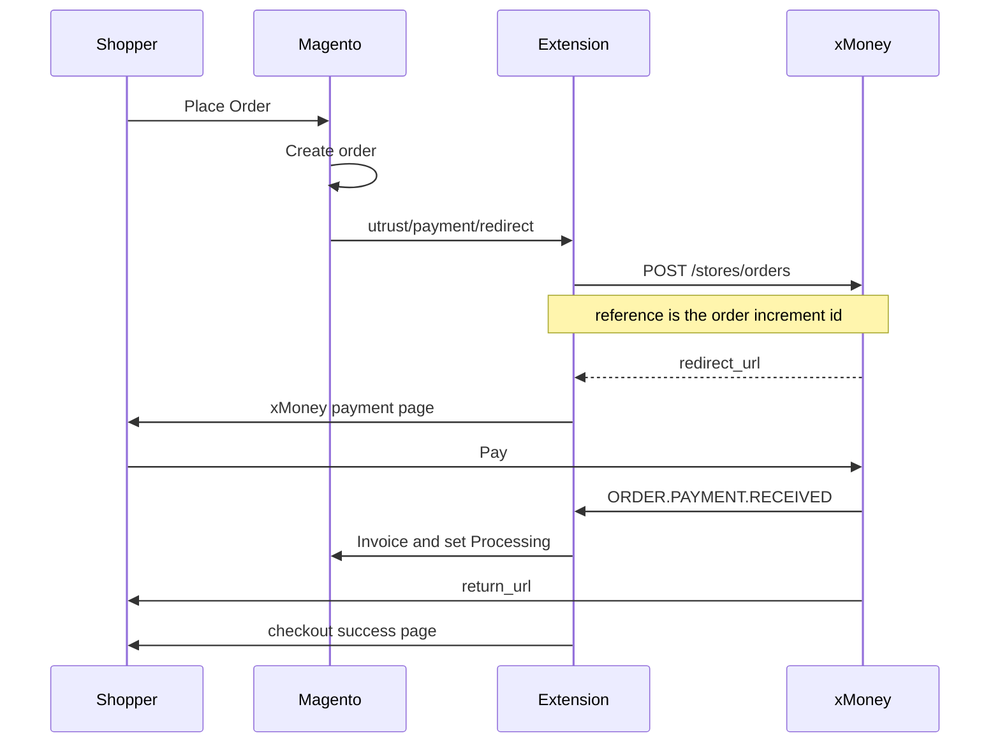
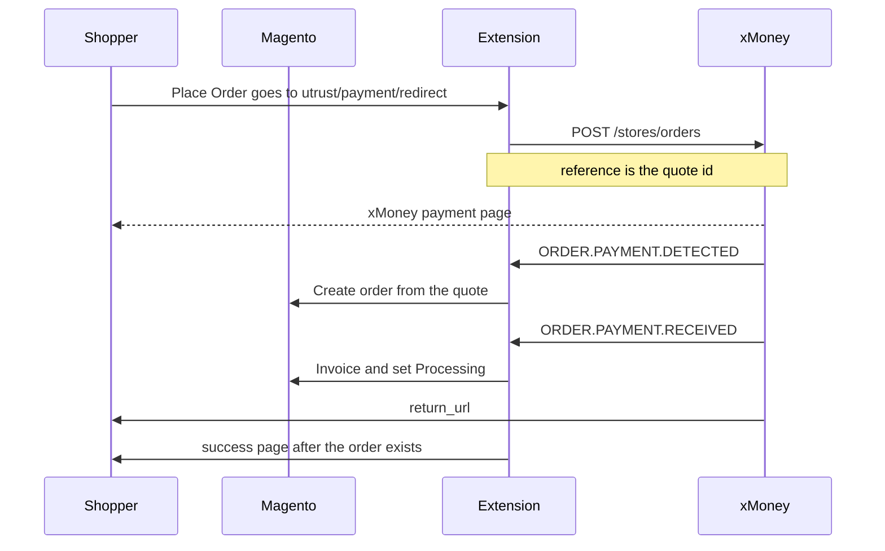

# Developer guide

This guide is for someone working on the **xMoney Crypto for Magento 2** extension. Store owners installing a release zip should use the [store setup guide](store_guide.md). The [README](../README.md) is the short overview of how checkout, this extension, and the xMoney merchant dashboard fit together.

The module code is `Utrust_Payment`. Composer package name is `utrust/module-payment`. The payment method code is `utrust`.

## What you need

- Magento Open Source **2.4.7-p10** on **PHP 8.2** for the Docker sandbox below. `composer.json` still allows PHP `>=7.4` and `magento/framework` `>=102.0.0`. Use the PHP version required by the Magento release you run. For 2.4.7-p10 that version is PHP 8.2.
- PHPUnit 9, only if you will run the unit tests. The test bootstrap does not boot Magento.
- A sandbox merchant account at the [sandbox dashboard](https://merchants.sandbox.crypto.xmoney.com/) so checkout calls the sandbox API.
- Composer access keys for `https://repo.magento.com/`, created in the next section. Keep them in your local Composer `auth.json`. Do not paste them into this repository.

## Install Magento with Docker

The sandbox store is Magento Open Source 2.4.7-p10 at `~/Sites/magento`, from [Mark Shust's Docker Configuration for Magento](https://github.com/markshust/docker-magento#setup). Install Docker Desktop first. Give Docker at least 6GB of RAM. The project is tested on Mac and Linux. On Windows, run it through Docker on WSL.

### Composer keys

Create an Adobe ID and sign in at [commercemarketplace.adobe.com](https://commercemarketplace.adobe.com/) or [account.magento.com](https://account.magento.com/).

Open **My Profile → Marketplace → Access Keys** and create a key pair. The public key is the Composer username. The private key is the Composer password for `repo.magento.com`. Adobe’s [authentication keys](https://experienceleague.adobe.com/en/docs/commerce-operations/installation-guide/prerequisites/authentication-keys) page describes the same screen.

Store the pair only in your local Composer auth file, `~/.config/composer/auth.json` (Composer 2) or `~/.composer/auth.json`. The `http-basic` entry for `repo.magento.com` looks like this, with your own keys in place of the placeholders:

```json
{
    "http-basic": {
        "repo.magento.com": {
            "username": "PUBLIC_KEY",
            "password": "PRIVATE_KEY"
        }
    }
}
```

Do not commit that file, and do not paste the keys into this repository, a pull request, or a support ticket.

### Download the patched release

The one-line setup `community 2.4.7` does not finish. Composer refuses that release because of advisory `PKSA-db8d-773v-rd1n`. The sample command on the Docker setup page also installs Mage-OS unless you pass `community`. The install that completed uses the patched release `2.4.7-p10`.

From a new project directory:

```bash
mkdir -p ~/Sites/magento
cd ~/Sites/magento
curl -s https://raw.githubusercontent.com/markshust/docker-magento/master/lib/template | bash
bin/setup-composer-auth
bin/download community 2.4.7-p10
bin/setup magento.test
```

`bin/setup-composer-auth` asks for the same public and private keys. `bin/setup` writes `magento.test` into `/etc/hosts` and asks for your system password. Magento files land in `src`. From this directory, `bin/magento` runs the Magento CLI inside the container. That container uses PHP 8.2 for 2.4.7-p10.

### Open the store before installing this module

The local TLS certificate comes from mkcert. Trust that certificate, or continue past the browser warning. It is a certificate for this computer. It is not installed in the macOS Keychain by default.

Confirm both of these load before you copy the payment module in:

- Storefront: [https://magento.test](https://magento.test)
- Admin: [https://magento.test/admin](https://magento.test/admin)

The local admin user published by that project is `john.smith` with password `password123`.

Two other local services come up with the same project:

- PhpMyAdmin: [http://localhost:8080](http://localhost:8080)
- Mailcatcher: [http://magento.test:1080](http://magento.test:1080)

Optional sample data is `bin/init`, documented on the [setup page](https://github.com/markshust/docker-magento#setup).

## Install Magento with Composer

Follow Adobe’s [Composer installation guide](https://experienceleague.adobe.com/en/docs/commerce-operations/installation-guide/composer) and the [system requirements](https://experienceleague.adobe.com/en/docs/commerce-operations/installation-guide/system-requirements). Use the same authentication keys as the Docker path.

## Install the module from this repository

Work from a checkout of this repository. The release zip is the store-owner install path, described in the [store setup guide](store_guide.md).

Run Magento in developer mode while you change this module. Static files are written when the storefront asks for them, and errors are shown instead of buried. See [Set the operation mode](https://experienceleague.adobe.com/en/docs/commerce-operations/configuration-guide/cli/set-mode) and [Application modes](https://experienceleague.adobe.com/en/docs/commerce-operations/configuration-guide/setup/application-modes).

On a normal Magento root, copy or symlink this repo to `app/code/Utrust/Payment`:

```bash
bin/magento deploy:mode:set developer
mkdir -p app/code/Utrust
ln -s /absolute/path/to/xmoney-crypto-for-magento2 app/code/Utrust/Payment
bin/magento module:enable Utrust_Payment
bin/magento setup:upgrade
bin/magento cache:flush
```

On the Docker project, Magento lives in `src`, and the container only sees files under that directory. From the Docker project directory, copy this repo into `src` and call the container CLI:

```bash
mkdir -p src/app/code/Utrust
cp -R /absolute/path/to/xmoney-crypto-for-magento2 src/app/code/Utrust/Payment
bin/magento deploy:mode:set developer
bin/magento module:enable Utrust_Payment
bin/magento setup:upgrade
bin/magento cache:flush
```

`app/code/Utrust/Payment/registration.php` must be the file Magento loads. The directory names `Utrust` and `Payment` match the module name `Utrust_Payment`.

Enable the method in **Stores → Configuration → Sales → Payment Methods → xMoney Crypto**. Use **Test mode** Yes with credentials from **Integrations → Magento 2** on the [sandbox dashboard](https://merchants.sandbox.crypto.xmoney.com/). Live credentials belong with **Test mode** No and the [live dashboard](https://merchants.crypto.xmoney.com/).

Changes under `app/code/Utrust/Payment` show up on the store after a refresh in developer mode. If a template or config change stays stale, flush the cache from **System → Cache Management** or with `bin/magento cache:flush`.

## Module map

| Area | File | Role |
| --- | --- | --- |
| Registration | `registration.php` | Registers `Utrust_Payment` |
| Declaration | `etc/module.xml` | Module name and setup version |
| Defaults | `etc/config.xml` | Title, instructions, currencies, restricted countries |
| Admin | `etc/adminhtml/system.xml` | Enabled, checkout flow, credentials, options, storefront text |
| API hosts | `etc/di.xml` | Live and sandbox base URLs |
| Method | `etc/payment.xml` | Method code `utrust` |
| Currency gate | `etc/events.xml`, `Observer/CurrencyValidator.php` | Hides the method when the quote base currency is unsupported |
| Routes | `etc/frontend/routes.xml` | Front name `utrust` |
| Schema | `etc/db_schema.xml` | `utrust_payment_id` on quote and order payments |
| Payment model | `Model/Payment/Utrust.php` | Magento payment method |
| Create order | `Model/Api.php` | `POST /stores/orders` with the API key |
| Payload | `Helper/Data.php` | Order or quote payload, return URLs, order creation from a quote |
| Signature | `Model/WebhookSignature.php` | HMAC-SHA256 over the canonical webhook body |
| Start | `Controller/Payment/Redirect.php` | Calls the API and redirects the shopper |
| Webhook | `Controller/Payment/Callback.php` | Verifies the signature and invoices or cancels |
| Return | `Controller/Payment/Response.php` | Sends the shopper to the success page |
| Cancel | `Controller/Payment/Cancel.php` | Handles the shopper leaving the payment page |
| Checkout UI | `view/frontend/web/js/view/payment/method-renderer/utrust-method.js` | Place Order behavior for each flow |
| Checkout config | `Model/ConfigProvider.php` | Passes the redirect URL, logo, instructions, and flow flag to checkout |
| Log | `Logger/Handler.php` | Writes `var/log/utrust.log` |

## Checkout flows

Admin **Checkout Flow → Alternative** is `payment/utrust/checkout_flow/flow`. Yes is the alternative flow. No, the default, is the standard flow.

Both flows end at the same xMoney endpoint. `Model/Api.php` posts JSON to `{api_url}/stores/orders` with `Authorization: Bearer {api key}`. A successful body has `data.type` of `orders_redirect` and `data.attributes.redirect_url`. The extension stores `data.id` as `utrust_payment_id` on the quote payment or the order payment.

The API host comes from `etc/di.xml`:

- Test mode Yes: `https://merchants.api.sandbox.crypto.xmoney.com/api`
- Test mode No: `https://merchants.api.crypto.xmoney.com/api`

The payload’s `return_urls` point at this store:

- `utrust/payment/response` when the shopper finishes on the payment page
- `utrust/payment/cancel` when the shopper cancels there
- `utrust/payment/callback` for server-to-server webhooks

### Standard flow

**Alternative** is No. The checkout script calls Magento `placeOrder`, which creates the order, then redirects to `utrust/payment/redirect`. The reference sent to xMoney is the order increment id.



If the API call fails, the extension restores the quote, cancels the new order, and sends the shopper to the cart. If the shopper opens the cancel URL, the order is canceled and the items are added back to the cart.

`ORDER.PAYMENT.DETECTED` is ignored in this flow. The order already exists.

### Alternative flow

**Alternative** is Yes. The checkout script redirects to `utrust/payment/redirect` without placing a Magento order. The reference sent to xMoney is the quote id.



The return action looks up the order for up to six attempts, one second apart. If the order is still missing, the shopper goes to the cart with a notice that the payment is still confirming.

The cancel URL only redirects to the cart. There is no Magento order until `ORDER.PAYMENT.DETECTED`. If that webhook already created an order and a later `ORDER.PAYMENT.CANCELLED` arrives, the callback cancels the order.

## Webhooks

`Controller/Payment/Callback.php` accepts the JSON body, checks the signature, and branches on `event_type`:

| Event | Standard flow | Alternative flow |
| --- | --- | --- |
| `ORDER.PAYMENT.DETECTED` | Ignored | Creates the Magento order from the quote when it does not exist yet |
| `ORDER.PAYMENT.RECEIVED` | Invoices the order and sets state Processing | Resolves or creates the order, then invoices it |
| `ORDER.PAYMENT.CANCELLED` | Cancels the order | Cancels the order when one exists |

Invoice and cancel run only for the `utrust` payment method. A second received notification does not invoice an order that can no longer be invoiced. A second cancel leaves an order that is already canceled.

The callback implements `CsrfAwareActionInterface` and skips the Magento form key. The HMAC is the check that the body came from someone who knows the webhook secret. A missing or mismatched signature returns HTTP 400. A processing exception returns HTTP 500. A handled event returns HTTP 200.

`Model/WebhookSignature.php` builds the canonical message by removing `signature`, flattening nested keys, sorting the keys, and concatenating key plus value. Booleans become `1` or an empty string. The signature is `hash_hmac('sha256', message, webhook_secret)`. `Helper/Data.php` reads the secret from `payment/utrust/credentials/webhook_secret`.

The merchant generates that secret in the dashboard under **Integrations → Magento 2**. It is shown once there. The same value must be saved in Magento before webhooks will verify.

## Configuration

| Admin field | Path | Effect |
| --- | --- | --- |
| Enabled | `payment/utrust/active` | Turns the method on. Default is off. |
| Alternative | `payment/utrust/checkout_flow/flow` | Yes creates the order on payment detected. No creates it on place order. |
| Test mode | `payment/utrust/credentials/sandbox` | Yes selects the sandbox API host. |
| Api Key | `payment/utrust/credentials/api_key` | Bearer token for `POST /stores/orders` |
| Webhook Secret | `payment/utrust/credentials/webhook_secret` | HMAC key for webhooks |
| New Order Status | `payment/utrust/order_status` | Status of a newly placed order. Default `pending`. |
| Payment from Applicable Countries | `payment/utrust/allowspecific`, `payment/utrust/specificcountry` | Magento country filter |
| Title | `payment/utrust/title` | Checkout label |
| Instructions | `payment/utrust/instructions` | Checkout text under the method |

`payment/utrust/currency` in `etc/config.xml` is the allow-list `Observer/CurrencyValidator.php` compares to the quote base currency. An empty list would show the method for every currency. The shipped list is the currencies in the [store setup guide](store_guide.md).

`payment/utrust/restricted_country_codes` removes those countries from the admin multi-select. A billing country xMoney rejects is handled in `Controller/Payment/Redirect.php`, which returns the shopper to the cart with a country-specific error when the API detail mentions an invalid country.

## Logging

Info messages from the redirect and callback controllers go to `var/log/utrust.log` under the Magento root. The handler is `Logger/Handler.php`. Look there when the API returns an error body, the signature check fails, or an order cannot be resolved from the webhook reference.

## Tests

From this repository root, with PHPUnit 9:

```bash
phpunit -c phpunit.xml.dist
```

`Test/bootstrap.php` loads `Utrust\Payment` classes from the repo, so the suite runs without Magento. `Test/Unit/PayloadSignatureTest.php` checks the canonical webhook string. `Test/Unit/PropertyDeclarationTest.php` checks that constructor assignments target declared properties, which PHP 8.2 requires.

## Contributing

Issues and ideas: [open a GitHub issue](https://github.com/utrustdev/xmoney-crypto-for-magento2/issues/new).

Fork the repository and open a pull request against `master`. Keep the style of the surrounding PHP: strict types where the file already uses them, Magento constructor injection, and the existing admin and checkout patterns.

Account-specific problems go to [support@xmoney.com](mailto:support@xmoney.com).

## Publishing

Publishing a release is limited to the xMoney development team. The steps are on the [publishing wiki](https://github.com/utrustdev/xmoney-crypto-for-magento2/wiki/Publishing).

The extension is GNU GPLv3. See [LICENSE](../LICENSE).
